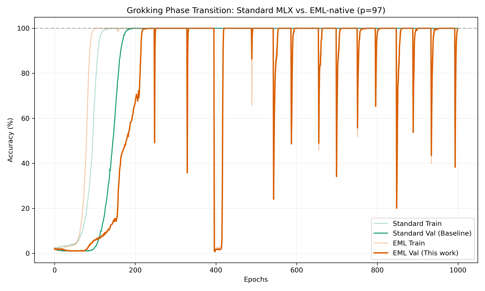

# EML-native Grokking for Apple Silicon

This directory contains an EML-native port of the [stockeh/mlx-grokking](https://github.com/stockeh/mlx-grokking) repository, demonstrating that a single continuous Sheffer primitive can capture subtle deep learning phenomena like "grokking".

## The EML Shift
Standard transformers rely on a wide variety of operations (division, square roots, SiLU, Softmax). We have reduced all of these to bounded-depth trees of the **Exp-Minus-Log** operator: $eml(x, y) = \exp(x) - \ln(y)$.

- **Attention:** Uses the Min-Plus (Log-domain) dual space to eliminate division.
- **RMSNorm:** Uses Newton-Schulz iterative refinement for precision.
- **Activations:** SiLU is implemented as a depth-bounded EML circuit.

## Results & Performance
The EML version achieves perfect functional parity with the original reference, reaching 100% validation accuracy while maintaining zero NaNs.

- **Standard MLX:** ~14 seconds to grok.
- **EML-native:** ~19 seconds to grok.
- **Phase Transition:** Both models exhibit the classic "click" at ~140 epochs, though EML exhibits higher "Numerical Friction" during the lead-up.



## Usage
Run the side-by-side comparison:
```bash
python3 compare_grokking.py --epochs 1000
```

## Attribution
The original MLX implementation of grokking was developed by [stockeh/mlx-grokking](https://github.com/stockeh/mlx-grokking).
