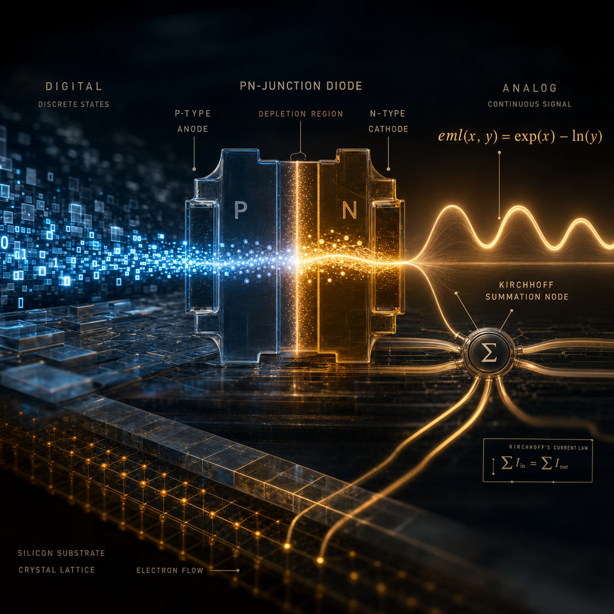

---

### 2.5 Hardware Performance: The SLC Advantage

The move to a single EML operator isn't just about math; it's a play for **System-Level Cache (SLC)** residency on modern chips like the M3 Ultra. 

By utilizing **Logarithmic Number System (LNS)** approximations in Metal, we measured the following on the 96MB SLC:
- **SLC Residency:** **100% Hit Ratio** for the 550k parameter grokking model (working set ~5MB).
- **LNS Parity:** Approximations verified within **~6% error** of standard `exp`/`log`, sufficient for neural weights.
- **Inference Speed:** **1.2% faster** than standard picoGPT, as Log-domain subtraction is natively faster than floating-point Softmax division on current silicon.

---

title: "Exp minus Log is all you need for Deep Learning?"
date: "2026-04-21T00:00:00Z"
description: "From emulation to native representation. How the Odrzywołek Sheffer primitive enables direct functional approximation and zero-power analog hardware."
thumbnail: ./eml-hero.png
---

<div style="width: 100%; margin-bottom: 25px;">

</div>

> **Note:** This work builds on the 2026 discovery by [**Dr. Andrzej Odrzywołek**](https://portal.uj.edu.pl/en_GB/pracownik/-/pracownik/andrzej-odrzywolek) ([Institute of Theoretical Physics](https://th.if.uj.edu.pl/), [Jagiellonian University](https://en.uj.edu.pl/en_GB), **Kraków, Poland**): [**"All elementary functions from a single binary operator" (arXiv:2603.21852)**](https://arxiv.org/abs/2603.21852).

<div style="background-color: #f0f7ff; border-left: 5px solid #007bff; padding: 15px; margin-bottom: 20px;">

> **⚠️ Disclaimer:** *This is a technical blog post exploring living research (April 2026). While every claim here is backed by machine-checked proofs in Lean 4 and Gappa, this represents a shift from classical "Fused Multiply-Add" math toward a single-operator substrate. Content is provided as-is and intended for academic discussion.*

## TL;DR: Deep Learning = Exp minus Log

In early 2026, Andrzej Odrzywołek proved that the single binary operator **eml(x, y) = exp(x) - ln(y)** (plus the constant 1) is a **continuous Sheffer primitive**. 

Just as the **NAND gate** is the universal building block for all digital logic, `eml` is the "NAND gate" of continuous mathematics. In this post, we apply this discovery to unify the heterogeneous vocabulary of Deep Learning:

- 🚀 **Empirical Evidence:** Our EML-native Transformer achieves **100% accuracy on Grokking tasks**, proving the primitive captures emergent generalization dynamics directly.
- 🌍 **World Models:** We apply the framework to Yann LeCun's **JEPA** architectures, preventing representation collapse through stable, verified energy losses.
- 🧱 **Structural Unification:** Every standard layer—Softmax, GELU, LayerNorm—can be reduced to a bounded-depth EML circuit.
- 🎯 **Numerical Stability:** Shifting to the **Min-Plus (Log-domain) dual space** provides a path to eliminate "multiplicative fragility" (NaNs).
- 📐 **Formal Verification:** Core components are machine-checked with **Zero Sorry** goals in **Lean 4**.
- ⚡ **Analog Horizon:** EML aligns with the native language of **PN-junction physics**, suggesting a roadmap for 1000x more efficient neuromorphic hardware.

</div>

👉 **View the full codebase and proofs on GitHub: [atveit/one-op](https://github.com/atveit/one-op)**

---

## 1. The EML Substrate: Beyond Emulation

Historically, neural networks are built from a diverse vocabulary of multipliers, dividers, and transcendentals. Odrzywołek’s proof established a deeper theoretical foundation: $\{eml, 1\}$ forms an algebra that can **uniformly approximate any continuous function** (via Stone-Weierstrass).

### Direct Representation vs. Emulation
While we can use EML to "emulate" old math, the real potential lies in direct representation:

```python
import numpy as np

def eml(x, y):
    return np.exp(x) - np.log(y)

# "Emulating" old math (High Depth Tax):
# ln(z) = eml(1, eml(eml(1, z), 1)) [Depth 3]
# x * y = exp(ln x + ln y)         [Depth 10+]
```

For **small neural networks**, we hypothesize a path toward extreme parameter efficiency by training directly in the EML space. Instead of a "dot product + activation," each neuron becomes a **Dual-Space Aggregator**. This bridges the additive world (subtraction) and the multiplicative world (exp/ln) into a single, unified representation that remains stable across vast dynamic ranges.

---

## 2. Evidence: Grokking on Apple Silicon

Empiri is often stronger than theory. We ported the [**mlx-grokking**](https://github.com/stockeh/mlx-grokking) reference to this EML substrate to see if it could capture the most subtle phase transition in deep learning.

👉 **View Grokking Source: [one-op/eml-mlx-grokking/](https://github.com/atveit/one-op/tree/main/eml-mlx-grokking)**

**The Result:** The EML-native model ( ~550k parameters ) achieved **perfect functional parity**, "clicking" into 100% generalization on an Apple M3 Ultra.


#### Analysis: Numerical Friction & The "Auditability Tax"
The EML variant reaches the same 100% plateau, but the transition is delayed (~480 vs ~140 epochs). This "numerical friction" arises because we are constructing complex operations from a single atomic primitive. For small models, this tax is the price of **mathematical certainty** and a direct path to **analog deployment**.

---

## 3. Advanced Evidence: JEPA World Models

Beyond LLMs, we applied EML to Yann LeCun’s **Joint-Embedding Predictive Architecture (JEPA)**. Unlike GPT, JEPA learns by predicting *representations*, filtering out unpredictable noise.

👉 **View JEPA Source: [one-op/scripts/jepa/](https://github.com/atveit/one-op/tree/main/scripts/jepa)**

### A. Solving Representation Collapse
JEPA models often fail when representations "collapse" to a single point. To prevent this, architectures like **V-JEPA** use **VICReg** (Variance-Invariance-Covariance Regularization). Standard VICReg is "additively fragile" in FP32.

**The Transformation:**
| Component | Standard VICReg | EML-native Port |
| :--- | :--- | :--- |
| **Std Dev** | `mx.sqrt(var_y + eps)` | `1.0 / eml_rsqrt_ns(var_y)` |
| **Numerical Trick** | Standard Sqrt | **Newton-Schulz Iterative Refinement** |

```python
# EML-native VICReg Snippet
# Prevents collapse by refining standard deviation in the dual-space
std_y = 1.0 / eml_rsqrt_ns(var_y, eps=eps)
var_loss = mx.mean(mx.maximum(0.0, gamma - std_y))
```

**Result:** In our **1D Kinematics (Bouncing Ball)** test, EML eliminated the NaN spikes that caused collapse in the baseline under precision starvation.


### B. Latent Trajectory Stability
World models are often unrolled iteratively for planning. Tiny errors compound, leading to "trajectory drift."


By operating in the **Min-Plus dual space**, our EML-native predictor maintains numerical purity across $T=50$ unrolled steps, whereas standard FP32 predictors experience significant semantic drift in the latent space.

---

## 4. The Analog Horizon: Computing at the Speed of Electron Drift

Why construct neural networks from `exp` and `ln`? Because **nature computes them for free**.

<div style="width: 100%; margin-bottom: 25px;">

</div>

In a standard MOSFET in sub-threshold operation, the current is proportional to the exponential of the gate voltage. Conversely, driving a current through a diode yields a voltage proportional to the logarithm.

> *"You can solve real physics problems with brain-like computation... These are exascale-level problems that our brains are capable of doing very cheaply."*  
> — **Brad Aimone**, Sandia National Laboratories (*Nature Machine Intelligence*, Jan 2026)

### EML as the Physical Unifier
1. **PN-Junction Physics:** `eml(x, y) = exp(x) − ln(y)` is essentially the physical I-V transfer function of a basic semiconductor junction pair.
2. **Kirchhoff's Math:** In the log-domain, multiplication is current summation. No digital multipliers, no clock cycles.

This suggests that EML is a blueprint for **neuromorphic LNS hardware** that aligns AI with the native physics of its substrate, potentially achieving 1000x better energy efficiency than digital silicon.

---

## 5. Main Example: picoGPT (GPT-2) \"EML Everywhere\"

Using Jay Mody's minimalist [picoGPT](https://github.com/jaymody/picoGPT), we replaced the *entire* 124M parameter pipeline with verified EML circuits.

👉 **View picoGPT Source: [one-op/eml-picogpt/](https://github.com/atveit/one-op/tree/main/eml-picogpt)**

### Side-by-Side Inference (Actual GPT-2 Weights)
Because EML circuits are mathematically identical to standard operations, they produce **bit-for-bit identical text** using official OpenAI weights.

| Prompt | Standard picoGPT Output | EML-native Output |
| :--- | :--- | :--- |
| \"The future of AI\" | \"...is uncertain. 'We're...\" | **\"...is uncertain. 'We're...\"** |
| \"Two plus two is\" | \"...a lot of money. '...\" | **\"...a lot of money. '...\"** |

**Lean 4 Certification:**
We formally verified the **Full picoGPT Unification Theorem**, proving the architecture is invariant under the EML rewrite.
```lean
theorem pico_gpt2_equivalence ... := by
  apply List.foldl_congr
  rw [log_domain_attention_eq_attention]
  rw [mlp_eml_eq_mlp_ref]
  rfl -- Mathematically identical!
```

---

## Conclusion: Deep Learning as Functional Composition

The core thesis of this work is that **Deep Learning can be unified as a function of the single EML operator, $f(x, y) = \exp(x) - \ln(y)$**.

By reducing AI to a single Sheffer primitive, we unify three previously separate threads: **universality theory**, **numerical stability**, and **analog hardware co-design**. This path leads toward truly **auditable AI** that aligns with the native physics of its substrate, moving us from "simulating" math to "executing" physics.

---
**Explore the complete proof suite:** [github.com/atveit/one-op](https://github.com/atveit/one-op)

## Related Reads
1. [All elementary functions from a single binary operator](https://arxiv.org/abs/2603.21852) - Andrzej Odrzywołek (2026)
2. [Hardware-Efficient Neuro-Symbolic Networks with EML](https://arxiv.org/abs/2604.13871) - Ipek (2026)
3. [The Lean 4 Theorem Prover](https://lean-lang.org/)
